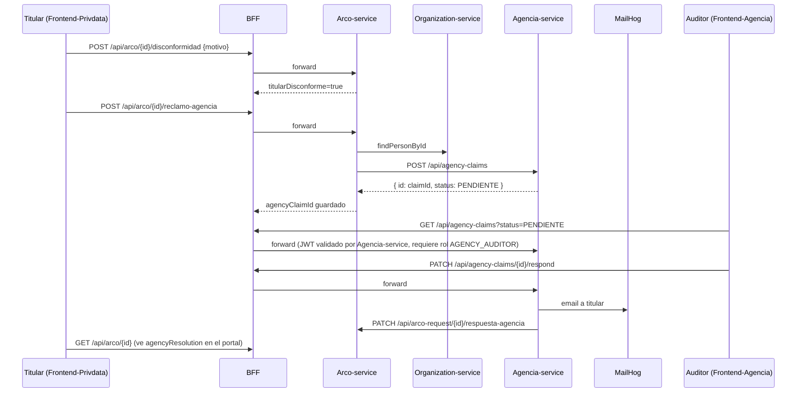

# Agencia-service — Resumen y Flujo

> **Estado: diseño, no implementado.** Este documento (y los demás en `docs/agencia-service/`) describe un microservicio **nuevo**, propuesto para simular a la Agencia de Protección de Datos Personales (el organismo fiscalizador externo de la Ley 21.719) dentro de PrivData. Nada de esto existe aún en el código — es la base para implementarlo.

## Motivación

Cuando una solicitud ARCO es resuelta (`RESPONDIDA` o `RECHAZADA`) y el titular no está conforme, la ley le da el derecho a reclamar ante la Agencia. Hoy Arco-service ya soporta el primer paso (`titularDisconforme`, endpoint `POST /api/arco-request/{id}/disconformidad`), pero no existe nada que simule la Agencia recibiendo y resolviendo ese reclamo. Este diseño agrega esa pieza como un microservicio independiente, con su propio frontend ("sistema de un tercero"), reusando el login de Auth-service con un rol nuevo.

## Decisiones ya tomadas

| Tema | Decisión |
|---|---|
| Autenticación del auditor | Reusa Auth-service (mismo JWT/login). Rol nuevo `AGENCY_AUDITOR`. **Sin permisos finos** — el rol es el único gate: si lo tienes, puedes ver y responder todo. |
| Validación del JWT en Agencia-service | Filtro propio, **stateless** (verifica firma con el mismo `JWT_SECRET` compartido, lee el rol directo del claim del token — sin reconsultar la BD como hace Auth-service). Es el primer microservicio downstream que valida JWT de verdad (Arco/Organization/Compliance hoy no lo hacen, confían en el BFF). |
| Respuesta del auditor | Única (no hilo de mensajes). Un campo `agencyResponse` + el reclamo pasa a estado `RESPONDIDO`. |
| Estados del reclamo | Simplificado a 2: `PENDIENTE` → `RESPONDIDO` (sin `EN_REVISION` por ahora; se puede agregar después sin romper nada). |
| Entrada del frontend nuevo | Pasa por el BFF existente (`:8085`), igual que el resto — nuevo `AgenciaClient`/`AgenciaBffService`/`AgenciaBffController`, consistente con el patrón documentado en `CLAUDE.md` ("Adding a New Endpoint"). |
| Comunicación con el titular | Email (servicio de correo propio de Agencia-service, mismo patrón JavaMailSender + MailHog que ya usan Auth-service y Arco-service) **+** la respuesta también se sincroniza de vuelta a `arco_request` para que el titular la vea en el portal de PrivData. |
| Transacciones | Sin transacciones distribuidas (igual que el resto del sistema). El reclamo se guarda primero en Agencia-service (fuente de verdad); el email y el callback a Arco-service son best-effort — si fallan, se loguea pero no se revierte la respuesta ya guardada. |

## Flujo end-to-end

1. **Titular insatisfecho** (`Frontend-Privdata`, card de resolución): pregunta "¿Está conforme con esta resolución?".
   - **Conforme** → reusa el endpoint ya existente `PATCH /api/arco/{id}/status` con `newStatus=CERRADA`. No requiere nada nuevo.
   - **No conforme** → llama al endpoint ya existente `POST /api/arco/{id}/disconformidad` con el motivo. Esto ya existe y solo marca `titularDisconforme=true` + guarda el motivo en el historial.
2. Una vez marcado disconforme, aparece el botón **"Hacer reclamo ante la Agencia"** → dispara el endpoint **nuevo** `POST /api/arco/{id}/reclamo-agencia` (vía BFF → Arco-service). Reusa el motivo ya guardado (no se le vuelve a preguntar al titular), valida el plazo (`agencyClaimDeadline`), busca los datos de la persona (`OrganizationClient`, ya existe) y llama a Agencia-service para crear el reclamo.
3. **Agencia-service** guarda el reclamo (`agency_claim`, estado `PENDIENTE`) y queda disponible para el auditor.
4. El auditor (`AGENCY_AUDITOR`, logueado con sus credenciales de PrivData) entra al frontend nuevo, ve el reclamo en el panel "Reclamos", abre el modal y responde.
5. Responder dispara, en este orden: (a) guarda la respuesta localmente y pasa a `RESPONDIDO`, (b) envía email al titular, (c) llama de vuelta a Arco-service para sincronizar la respuesta y cerrar la solicitud (`status=CERRADA`).
6. El titular ve la respuesta de la Agencia en su portal de PrivData (`TitularSeguimiento.tsx`) **y** en su correo. Nunca entra al sistema de la Agencia.

## Diagrama de secuencia

## Pendiente de diseñar

- Layout del frontend nuevo (nav, footer, sidebar, modal) — se aborda en una siguiente iteración.
- Posible extensión a hilo de mensajes (`reclamo_mensaje` 1:N) si el MVP de respuesta única resulta insuficiente.

Ver también: [02-modelo-datos.md](02-modelo-datos.md), [03-contrato-endpoints.md](03-contrato-endpoints.md).
