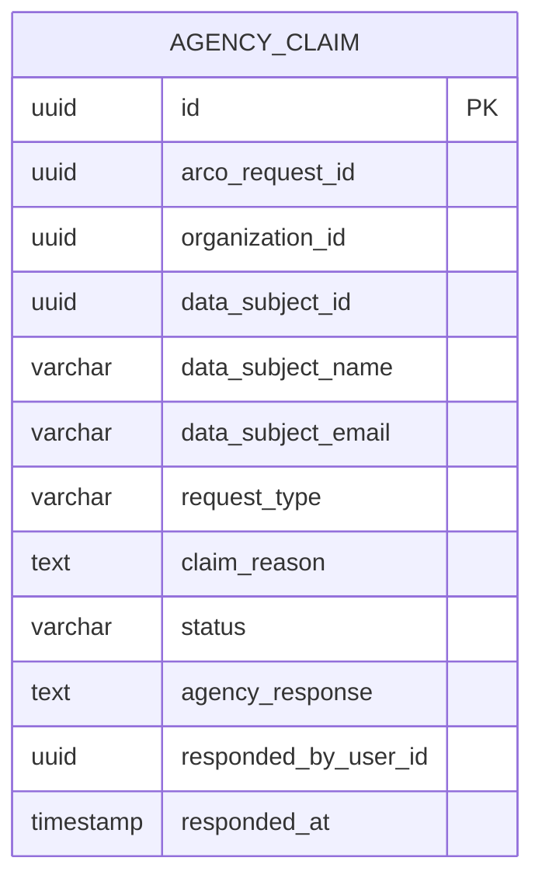

# Agencia-service — Modelo de Datos (Diseño)

> Estado: diseño, no implementado. Ver [01-resumen-y-flujo.md](01-resumen-y-flujo.md) para el contexto y las decisiones ya tomadas.

Convención: nombres de tabla/columna en inglés (consistente con el resto del sistema, p. ej. `arco_request`), valores de enum en español donde el dominio ya lo hace así (p. ej. `ArcoStatus`). Todas las PK son `UUID`.

---

## 1. Base de datos nueva: `agencia_db` (Agencia-service, puerto sugerido `8084`, postgres-agencia `5437`)

### Tabla `agency_claim`

| Campo | Tipo | Restricciones | Notas |
|---|---|---|---|
| id | UUID | PK | el "ID de reclamo" que ve el auditor |
| arco_request_id | UUID | NOT NULL | FK lógica → `arco_db.arco_request.id` |
| organization_id | UUID | NOT NULL | FK lógica → `organizations.id` |
| data_subject_id | UUID | NOT NULL | FK lógica → `persons.id` |
| data_subject_name | varchar(255) | NOT NULL | snapshot al momento del reclamo |
| data_subject_email | varchar(255) | NOT NULL | snapshot — destino del correo de respuesta |
| data_subject_rut | varchar(50) | nullable | snapshot |
| request_type | varchar(50) | NOT NULL | snapshot de `ArcoRequestType` (ACCESO, RECTIFICACION, CANCELLATION, OPOSICION, PORTABILIDAD, BLOQUEO_TEMPORAL) |
| original_resolution_summary | text | nullable | snapshot de la resolución original de PrivData, para contexto del auditor |
| original_denial_legal_basis | text | nullable | snapshot (solo si la solicitud fue `RECHAZADA`) |
| claim_reason | text | NOT NULL | motivo del titular — reusado desde el historial de disconformidad, no se vuelve a pedir |
| status | varchar(20) | NOT NULL, default `PENDIENTE` | enum: `PENDIENTE`, `RESPONDIDO` |
| agency_response | text | nullable | texto escrito por el auditor en el modal |
| responded_by_user_id | UUID | nullable | FK lógica → `auth_db.users.id` (el auditor) |
| responded_by_email | varchar(255) | nullable | snapshot del email del auditor, evita resolver el id en el front |
| responded_at | timestamp | nullable | — |
| submitted_at | timestamp | NOT NULL | cuando el titular hizo el reclamo |
| created_at / updated_at | timestamp | NOT NULL | — |

**Por qué snapshots en vez de joins en vivo:** Agencia-service simula a un tercero externo — no debería depender de llamadas en vivo a Organization-service/Auth-service solo para listar sus propios reclamos. Los datos relevantes (nombre, email, rut, resumen de resolución) se copian al momento de crear el reclamo.

**Por qué solo 2 estados:** la decisión fue respuesta única (no hilo de mensajes). Si más adelante se necesita un estado intermedio (p. ej. "el auditor está revisando"), se puede agregar `EN_REVISION` sin romper nada, porque ninguna lógica depende hoy de que sean exactamente 2 valores.

---

## 2. Columnas nuevas en `arco_db.arco_request` (Arco-service)

| Campo | Tipo | Notas |
|---|---|---|
| agency_claim_id | UUID, nullable | referencia al `agency_claim.id` creado en Agencia-service |
| agency_resolution | text, nullable | respuesta de la Agencia, sincronizada vía callback |
| agency_responded_at | timestamp, nullable | — |

**Importante:** las 3 son **nullable**. Esto evita el problema que ya tuvimos con `persons.blocked/anonymized/deletion_request/data_status` — Postgres rechaza `ALTER TABLE ... ADD COLUMN ... NOT NULL` sobre una tabla con filas existentes si no hay `DEFAULT`, y `ddl-auto=update` no genera uno automáticamente. Al ser nullable, Hibernate puede agregarlas sin intervención manual aunque `arco_request` ya tenga datos.

---

## 3. Auth-service (`auth_db`) — rol nuevo, sin tabla nueva

No se crea ninguna tabla. Se agrega:
- Un rol nuevo `AGENCY_AUDITOR` en `roles` (seedeado en `DataInitializer`, igual que `SUPER_ADMIN`/`ORG_ADMIN`/`ANALYST`/`AUDITOR`/`END_USER`).
- **Sin permisos asociados** en `role_permissions` — la decisión fue que el rol mismo es el gate (no hay `AGENCY_CLAIM_VIEW`/`AGENCY_CLAIM_RESPOND` como permisos finos). El filtro JWT de Agencia-service verifica directamente la presencia del rol/authority `AGENCY_AUDITOR` en el token.
- Un `Person` + `User` de prueba para el auditor (mismo patrón que el admin/titular semilla ya existentes), para tener una cuenta de prueba end-to-end.

---

## 4. Diagrama ER (Agencia-service)

Sin relaciones físicas dentro de `agencia_db` (tabla única). Las relaciones cross-service son todas lógicas:

| Campo | → Servicio | Tabla.Campo |
|---|---|---|
| `arco_request_id` | Arco-service | `arco_request.id` |
| `organization_id` | Organization-service | `organizations.id` |
| `data_subject_id` | Organization-service | `persons.id` |
| `responded_by_user_id` | Auth-service | `users.id` |
| `arco_request.agency_claim_id` (inverso) | Agencia-service | `agency_claim.id` |
