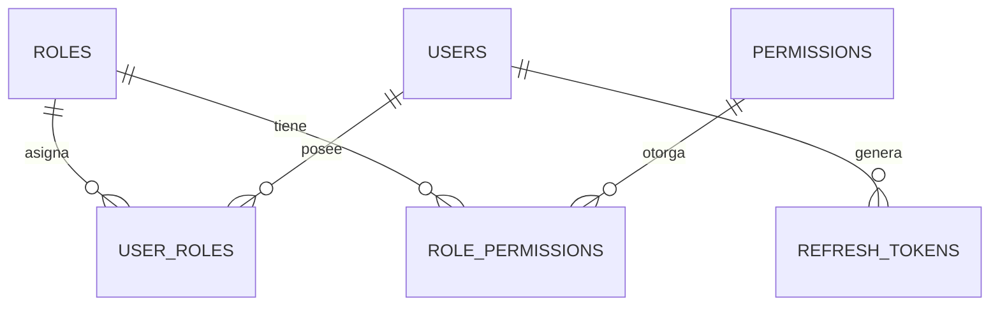
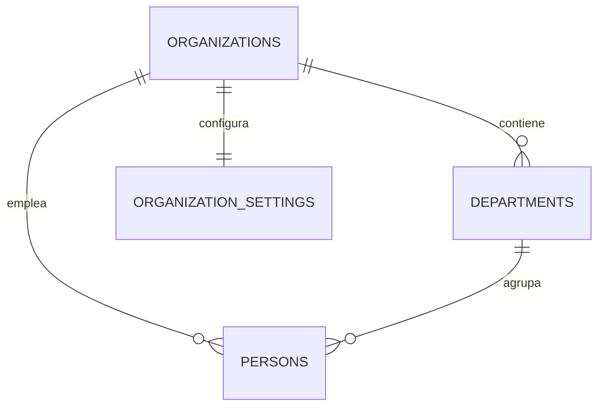
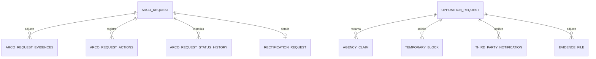
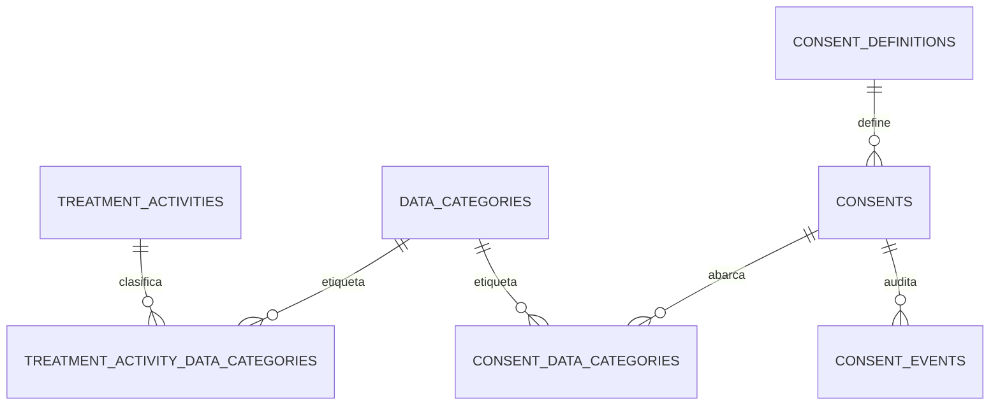

# Modelo de Base de Datos — PrivData

> **Nota:** el motor real es **PostgreSQL 16** (no MySQL) — cada microservicio tiene su propia base de datos, sin transacciones distribuidas. Las relaciones entre servicios se modelan como **FKs lógicas** (campos `UUID` sin `@ManyToOne` real, sin constraint físico). Todas las PK son `UUID`. La mayoría de entidades usan `@CreationTimestamp`/`@UpdateTimestamp` para `createdAt`/`updatedAt`. Este documento refleja el estado real de las 4 bases (`auth_db`, `organization_db`, `arco_db`, `compliance_db`) inspeccionado directamente vía `psql`.

---

## 1. Auth-service — `auth_db` (postgres-auth :5436)

Gestiona usuarios, autenticación, roles/permisos (RBAC) y auditoría global.

`AUDIT_LOGS` y `PASSWORD_RESET_CODES` son independientes (sin FK física), referenciados solo por `organizationId`/`email`.

### `users` — credenciales y cuenta del usuario

| Campo | Tipo | Restricciones |
|---|---|---|
| id | UUID | PK |
| organization_id | UUID | NOT NULL — FK lógica → Organization-service `organizations.id` |
| person_id | UUID | NOT NULL, UNIQUE — FK lógica → Organization-service `persons.id` |
| email | varchar(255) | NOT NULL, UNIQUE |
| password_hash | varchar(255) | NOT NULL |
| status | enum `user_status` | NOT NULL, default `PENDING` (`PENDING`, `ACTIVE`, `BLOCKED`, `INACTIVE`) |
| active | boolean | NOT NULL, default true |
| failed_login_attempts | integer | NOT NULL, default 0 |
| locked_until | timestamp | nullable |
| last_login_at | timestamp | nullable |
| password_changed_at | timestamp | nullable |
| created_at / updated_at | timestamp | NOT NULL |

Índices: `idx_users_email`, `idx_users_organization_id`, `idx_users_person_id`.

### `roles` — roles del sistema (RBAC)

| Campo | Tipo | Restricciones |
|---|---|---|
| id | UUID | PK |
| name | varchar(50) | NOT NULL, UNIQUE |
| description | varchar(255) | — |
| active | boolean | NOT NULL, default true |
| created_at / updated_at | timestamptz | NOT NULL |

### `permissions` — permisos atómicos (`MODULE_ACTION`)

| Campo | Tipo | Restricciones |
|---|---|---|
| id | UUID | PK, default `gen_random_uuid()` |
| module | varchar(255) | NOT NULL |
| action | varchar(255) | NOT NULL |
| description | varchar(255) | — |
| active | boolean | NOT NULL, default true |
| created_at / updated_at | timestamptz | NOT NULL |

Constraint: `UNIQUE(module, action)`.

### `role_permissions` — N:N `roles` ↔ `permissions`

| Campo | Tipo | Restricciones |
|---|---|---|
| id | UUID | PK |
| role_id | UUID | FK → `roles.id` ON DELETE CASCADE |
| permission_id | UUID | FK → `permissions.id` ON DELETE CASCADE |
| active | boolean | NOT NULL, default true |
| created_at | timestamptz | NOT NULL |
| assigned_at | timestamptz | nullable |
| assigned_by | UUID | nullable |

Constraint: `UNIQUE(role_id, permission_id)`.

### `user_roles` — N:N `users` ↔ `roles`

| Campo | Tipo | Restricciones |
|---|---|---|
| id | UUID | PK |
| user_id | UUID | FK → `users.id` ON DELETE CASCADE |
| role_id | UUID | FK → `roles.id` ON DELETE RESTRICT |
| active | boolean | NOT NULL, default true |
| assigned_at | timestamptz | NOT NULL, default now() |
| assigned_by | UUID | nullable |
| expires_at | timestamptz | nullable |

Constraint: `UNIQUE(user_id, role_id)`.

### `refresh_tokens` — sesiones JWT refresh

| Campo | Tipo | Restricciones |
|---|---|---|
| id | UUID | PK |
| user_id | UUID | FK → `users.id` ON DELETE CASCADE |
| token | text | NOT NULL, UNIQUE |
| created_by_ip | text | NOT NULL |
| user_agent | text | NOT NULL |
| expires_at | timestamptz | NOT NULL |
| revoked_at | timestamptz | nullable |
| created_at / updated_at | timestamp | NOT NULL |

### `audit_logs` — bitácora global (consumida también por otros servicios vía `POST /auth/audit`)

| Campo | Tipo | Restricciones |
|---|---|---|
| id | UUID | PK |
| organization_id | UUID | nullable — FK lógica → `organizations.id` |
| action | varchar(50) | NOT NULL |
| entity_type | varchar(100) | NOT NULL |
| detail | text | NOT NULL |
| performed_by_email | varchar(255) | nullable |
| created_at | timestamp | NOT NULL |

### `password_reset_codes` — códigos de recuperación de contraseña

| Campo | Tipo | Restricciones |
|---|---|---|
| id | UUID | PK |
| email | varchar(255) | NOT NULL |
| code | varchar(255) | NOT NULL |
| expires_at | timestamp | NOT NULL |
| used | boolean | NOT NULL |

---

## 2. Organization-service — `organization_db` (postgres-organization :5433)

Modela la organización (single-tenant), sus departamentos y las personas (incluye al "titular" de derechos ARCO).

### `organizations` — la única organización del tenant

| Campo | Tipo | Restricciones |
|---|---|---|
| id | UUID | PK — debe coincidir con `admin.organization-id` de Auth-service |
| name | varchar(255) | NOT NULL |
| legal_name | varchar(255) | — |
| rut | varchar(20) | UNIQUE |
| business_type | varchar(100) | — |
| email | varchar(255) | — |
| phone | varchar(50) | — |
| address | varchar(500) | — |
| is_active | boolean | NOT NULL |
| created_at / updated_at | timestamp | NOT NULL |

> Sembrada vía `JdbcTemplate` + `ON CONFLICT (id) DO NOTHING` (no usar `repository.save()`/`entityManager.persist()` con UUID prefijado).

### `departments` — unidades organizacionales

| Campo | Tipo | Restricciones |
|---|---|---|
| id | UUID | PK |
| organization_id | UUID | FK → `organizations.id` |
| name | varchar(150) | NOT NULL |
| description | varchar(255) | — |
| is_active | boolean | NOT NULL |
| created_at | timestamp | NOT NULL |

Constraint: `UNIQUE(organization_id, name)` — `uq_departments_org_name`.

### `persons` — el "titular" (staff/data subject) — pieza central de derechos ARCO

| Campo | Tipo | Restricciones |
|---|---|---|
| id | UUID | PK |
| organization_id | UUID | FK → `organizations.id`, NOT NULL |
| department_id | UUID | FK → `departments.id`, nullable |
| first_name | varchar(100) | NOT NULL |
| last_name | varchar(100) | NOT NULL |
| full_name | varchar(200) | NOT NULL |
| rut | varchar(20) | — |
| email | varchar(150) | — |
| phone | varchar(50) | — |
| position | varchar(120) | — |
| is_active | boolean | NOT NULL |
| **blocked** | boolean | NOT NULL, default `false` — bloqueo inmediato (Art. 8° ter, Cancelación/Oposición) |
| **anonymized** | boolean | NOT NULL, default `false` |
| **deletion_request** | boolean | NOT NULL, default `false` |
| **data_status** | varchar(255) (enum `DataStatus`) | NOT NULL, default `ACTIVE` — `ACTIVE`, `BLOCKED`, `DELETION_REQUESTED`, `ANONYMIZED` |
| created_at / updated_at | timestamp | NOT NULL |

> Los 4 campos en negrita (`blocked`/`anonymized`/`deletion_request`/`data_status`) se agregaron junto al flujo de Cancelación de Arco-service (`SupresionService.crear()` llama `OrganizationClient.blockDataSubject`). Al añadirlos sobre una tabla `persons` ya poblada, Hibernate (`ddl-auto=update`) no pudo generar el `ALTER TABLE ... NOT NULL` automáticamente (Postgres rechaza `NOT NULL` sin `DEFAULT` en tabla no vacía) — se agregaron manualmente con `DEFAULT` vía SQL directo.

### `organization_settings` — configuración 1:1 de la organización

| Campo | Tipo | Restricciones |
|---|---|---|
| id | UUID | PK |
| organization_id | UUID | FK → `organizations.id`, UNIQUE |
| default_language | varchar(20) | NOT NULL |
| privacy_email | varchar(150) | — |
| allow_data_exports | boolean | NOT NULL |
| updated_at | timestamp | NOT NULL |

---

## 3. Arco-service — `arco_db` (postgres-arco :5434)

Gestiona las 6 solicitudes ARCO (Ley 21.719) vía Factory Method (`com.example.demo.arco.*`). Incluye un subsistema de **Oposición** más detallado (`opposition_request` + reclamo ante agencia + bloqueo temporal + notificación a terceros) que coexiste con el modelo genérico `arco_request` usado por el router.

> `opposition_request` y su árbol (`agency_claim`, `temporary_block`, `third_party_notification`, `evidence_file`) corresponden al subsistema "dormido" `OppositionService` (459 líneas) movido a `arco/oposicion/` en el refactor de paquetes — **no está conectado a ningún controller** (código preservado para uso futuro). El flujo activo de OPOSICIÓN hoy pasa por `arco_request` (vía `OposicionFactory`/`OposicionService`, livianos), no por esta tabla.

### `arco_request` — entidad central, todas las solicitudes ARCO (vía router/Factory Method)

| Campo | Tipo | Restricciones |
|---|---|---|
| id | UUID | PK |
| organization_id | UUID | NOT NULL — FK lógica → Organization-service `organizations.id` |
| data_subject_id | UUID | NOT NULL — FK lógica → Organization-service `persons.id` |
| assigned_to_user_id | UUID | nullable — FK lógica → Auth-service `users.id` |
| request_type | varchar (enum) | NOT NULL — `ACCESO`, `RECTIFICACION`, `CANCELLATION`, `OPOSICION`, `PORTABILIDAD`, `BLOQUEO_TEMPORAL` |
| status | varchar (enum) | NOT NULL — `RECIBIDA`, `EN_REVISION`, `EN_GESTION`, `RESPONDIDA`, `RECHAZADA`, `CERRADA` |
| identity_verification_status | varchar (enum) | NOT NULL — `PENDIENTE`, `VERIFICADA`, `RECHAZADA` |
| request_channel | varchar (enum) | NOT NULL — `WEB_PORTAL`, `EMAIL`, `PHONE`, `IN_PERSON`, `LETTER`, `INTERNAL` |
| cancellation_action_type | varchar (enum) | nullable — `BLOCK`, `DELETE`, `ANONYMIZE` |
| submitted_at | timestamp | NOT NULL |
| due_date | timestamp | NOT NULL — `submittedAt` + 30 días hábiles (Art. 11) |
| description | text | NOT NULL |
| resolution_summary | text | nullable |
| resolved_at | timestamp | nullable |
| denial_legal_basis | text | nullable |
| extension_granted | boolean | NOT NULL, default `false` — prórroga única +30 días (Art. 11) |
| extended_due_date | timestamp | nullable |
| agency_claim_deadline | timestamp | nullable — plazo para reclamo ante agencia tras denegación |
| closed_at | timestamp | nullable |
| third_parties_notified | boolean | NOT NULL, default `false` |
| titular_disconforme | boolean | NOT NULL, default `false` — disconformidad registrada por el titular tras la resolución |
| created_at / updated_at | timestamp | NOT NULL |

Relaciones `1:N`: `arco_request_evidences`, `arco_request_actions`, `arco_request_status_history`. Relación `1:1` opcional: `rectification_request`.

### `rectification_request` — detalle específico de RECTIFICACIÓN (Art. 7°)

| Campo | Tipo | Restricciones |
|---|---|---|
| id | UUID | PK |
| arco_request_id | UUID | FK → `arco_request.id`, UNIQUE |
| first_name / last_name | varchar(255) | nullable — valor propuesto a rectificar |
| email / phone / position / rut | varchar(255) | nullable |

### `arco_request_actions` — bitácora de acciones ejecutadas sobre una solicitud

| Campo | Tipo | Restricciones |
|---|---|---|
| id | UUID | PK |
| arco_request_id | UUID | FK → `arco_request.id` |
| executed_by_user_id | UUID | nullable — FK lógica → `users.id` |
| action_type | varchar (enum) | NOT NULL — `SUBMITTED`, `UNDER_REVIEW`, `VERIFIED`, `APPROVED`, `REJECTED`, `REQUEST_MORE_INFO`, `EXECUTED`, `PARTIALLY_EXECUTED`, `FAILED`, `CLOSED` |
| result_summary | text | nullable |
| artifact_url | varchar(500) | nullable |
| executed_at | timestamp | NOT NULL |

### `arco_request_evidences` — archivos adjuntos a una solicitud

| Campo | Tipo | Restricciones |
|---|---|---|
| id | UUID | PK |
| arco_request_id | UUID | FK → `arco_request.id` |
| uploaded_by_user_id | UUID | nullable — FK lógica → `users.id` |
| evidence_type | varchar (enum) | NOT NULL — `DOCUMENT`, `IMAGE`, `VIDEO`, `AUDIO`, `OTHER` |
| file_name | varchar(255) | NOT NULL |
| file_url | varchar(500) | NOT NULL |
| file_type | varchar (enum) | NOT NULL — `PDF`, `JPG`, `JPEG`, `PNG`, `DOC`, `DOCX`, `XLS`, `XLSX`, `MP4`, `MP3`, `TXT`, `OTHER` |
| notes | text | nullable |
| uploaded_at | timestamp | NOT NULL |

### `arco_request_status_history` — historial de transiciones de estado

| Campo | Tipo | Restricciones |
|---|---|---|
| id | UUID | PK |
| arco_request_id | UUID | FK → `arco_request.id` |
| changed_by_user_id | UUID | nullable — FK lógica → `users.id` |
| previous_status / new_status | varchar (enum) | NOT NULL — mismos valores que `arco_request.status` |
| changed_at | timestamp | NOT NULL |
| comment | text | nullable |

### `arco_audit_log` — bitácora interna de Arco-service (independiente de `audit_logs` de Auth-service)

| Campo | Tipo | Restricciones |
|---|---|---|
| id | UUID | PK |
| request_id | UUID | NOT NULL (sin FK física) |
| arco_type | varchar (enum) | NOT NULL — `OPPOSITION`, `SUPPRESSION`, `RECTIFICATION`, `ACCESS`, `PORTABILITY`, `BLOCK` |
| action | varchar(255) | NOT NULL |
| actor_id | UUID | nullable |
| actor_type | varchar (enum) | NOT NULL — `TITULAR`, `REPRESENTATIVE`, `ANALYST`, `DPO`, `SYSTEM`, `AGENCY` |
| previous_status / new_status | varchar(255) | nullable |
| reason | text | nullable |
| ip_address | varchar(255) | nullable |
| created_at | timestamp | NOT NULL |

### `chilean_holiday` — feriados chilenos para cálculo de plazos hábiles

| Campo | Tipo | Restricciones |
|---|---|---|
| id | UUID | PK |
| holiday_date | date | NOT NULL, UNIQUE |
| year | integer | NOT NULL |
| description | varchar(255) | nullable |

Usada por `DeadlineCalculatorService`/`BusinessDaysCalculator` para calcular `dueDate` saltando fines de semana y feriados.

### Subsistema Oposición detallado (dormido, sin controller activo)

#### `opposition_request`

| Campo | Tipo | Restricciones |
|---|---|---|
| id | UUID | PK |
| organization_id / data_subject_id | UUID | NOT NULL — FK lógica |
| causal | varchar (enum) | NOT NULL — `INTERES_LEGITIMO`, `MARKETING_DIRECTO`, `FUENTE_ACCESO_PUBLICO` |
| status | varchar (enum) | NOT NULL — 19 estados (`RECEIVED` … `CLOSED`, incl. flujo de reclamo y bloqueo temporal) |
| opposed_treatment | text | NOT NULL |
| justification | text | nullable |
| requester_name / requester_email / requester_rut | varchar(255) | NOT NULL |
| representative_name / representative_rut | varchar(255) | nullable |
| is_public_entity | boolean | NOT NULL |
| requires_mandatory_acceptance | boolean | NOT NULL |
| treatment_activity_id | UUID | nullable — FK lógica → Compliance-service `treatment_activities.id` |
| submitted_at / due_date | timestamp | NOT NULL |
| extended / extended_at / extension_date | boolean/timestamp | — prórroga |
| acknowledged_at / resolved_at / resolved_by_user_id | timestamp/UUID | nullable |
| resolution_grounds | text | nullable |
| contact_address | varchar(255) | nullable |
| created_at / updated_at | timestamp | NOT NULL |

#### `agency_claim` — reclamo ante la Agencia de Protección de Datos

| Campo | Tipo | Restricciones |
|---|---|---|
| id | UUID | PK |
| opposition_request_id | UUID | FK → `opposition_request.id` |
| claim_causal | varchar (enum) | NOT NULL — `TOTAL_REJECTION`, `PARTIAL_REJECTION`, `SILENCE_EXPIRED`, `BLOCK_REJECTION` |
| status | varchar (enum) | NOT NULL — `REGISTERED`, `IN_REVIEW`, `RESOLVED` |
| agency_claim_deadline | timestamp | NOT NULL |
| impugned_decision / agency_resolution / supporting_documents | text | nullable |
| notification_channel | varchar(255) | nullable |
| suspension_ordered | boolean | NOT NULL |
| suspension_ordered_at | timestamp | nullable |
| submitted_at | timestamp | NOT NULL |
| created_at / updated_at | timestamp | NOT NULL |

#### `temporary_block` — bloqueo temporal solicitado durante una oposición

| Campo | Tipo | Restricciones |
|---|---|---|
| id | UUID | PK |
| opposition_request_id | UUID | FK → `opposition_request.id` |
| status | varchar (enum) | NOT NULL — `PENDING`, `APPROVED`, `REJECTED`, `EXPIRED` |
| justification | text | NOT NULL |
| requested_at / due_date | timestamp | NOT NULL |
| resolved_at / resolved_by_user_id / resolution_grounds | timestamp/UUID/text | nullable |
| rejected_notified_agency | boolean | NOT NULL |
| rejected_notified_at | timestamp | nullable |
| created_at / updated_at | timestamp | NOT NULL |

#### `third_party_notification` — notificación a terceros tras resolución de oposición

| Campo | Tipo | Restricciones |
|---|---|---|
| id | UUID | PK |
| opposition_request_id | UUID | FK → `opposition_request.id` |
| third_party_name | varchar(255) | NOT NULL |
| third_party_email | varchar(255) | nullable |
| notification_reason | text | NOT NULL |
| status | varchar (enum) | NOT NULL — `PENDING`, `SENT`, `CONFIRMED`, `FAILED` |
| sent_at / confirmed_at | timestamp | nullable |
| created_at / updated_at | timestamp | NOT NULL |

#### `evidence_file` — evidencia adjunta a una oposición

| Campo | Tipo | Restricciones |
|---|---|---|
| id | UUID | PK |
| opposition_request_id | UUID | NOT NULL (sin FK física declarada) |
| file_name | varchar(255) | NOT NULL |
| file_size_bytes | bigint | nullable |
| file_type | varchar(255) | nullable |
| storage_reference | varchar(255) | nullable |
| uploaded_by_user_id | UUID | nullable |
| uploaded_at / created_at / updated_at | timestamp | NOT NULL |

---

## 4. Compliance-service — `compliance_db` (postgres-compliance :5435)

Modela el Registro de Actividades de Tratamiento (RAT) y la gestión de consentimientos.

### `treatment_activities` — RAT (Arts. 14ter + 49)

| Campo | Tipo | Restricciones |
|---|---|---|
| id | UUID | PK |
| organization_id | UUID | NOT NULL — FK lógica → `organizations.id` |
| name | varchar(150) | NOT NULL |
| description | text | — |
| purpose | varchar(255) | NOT NULL |
| legal_basis | varchar (enum, 30) | NOT NULL — `CONSENTIMIENTO`, `CONTRATO`, `OBLIGACION_LEGAL`, `INTERES_LEGITIMO`, `INTERES_VITAL`, `FUNCION_PUBLICA` |
| data_subject_categories | varchar(255) | — |
| retention_period_days | integer | — |
| third_party_recipients | text | — |
| international_transfer | boolean | NOT NULL |
| data_systems | text | — |
| security_measures | text | — |
| status | varchar (enum, 20) | NOT NULL, default `ACTIVE` — `ACTIVE`, `INACTIVE`, `UNDER_REVIEW` |
| created_at / updated_at | timestamp | NOT NULL |

`containsSensitiveData` se calcula automáticamente a partir de las categorías sensibles asociadas vía `treatment_activity_data_categories`.

### `data_categories` — catálogo sembrado (20 categorías: 9 no sensibles + 11 sensibles, Art. 2g)

| Campo | Tipo | Restricciones |
|---|---|---|
| id | UUID | PK |
| name | varchar(100) | NOT NULL, UNIQUE |
| description | varchar(255) | — |
| sensitive | boolean | NOT NULL |
| active | boolean | NOT NULL |

### `treatment_activity_data_categories` — N:N `treatment_activities` ↔ `data_categories`

| Campo | Tipo | Restricciones |
|---|---|---|
| id | UUID | PK |
| treatment_activity_id | UUID | NOT NULL (sin FK física declarada) |
| data_category_id | UUID | NOT NULL |

Constraint: `UNIQUE(treatment_activity_id, data_category_id)`.

### `consent_definitions` — plantillas de consentimiento configurables por la organización

| Campo | Tipo | Restricciones |
|---|---|---|
| id | UUID | PK |
| organization_id | UUID | NOT NULL — FK lógica |
| title | varchar(150) | NOT NULL |
| description | text | — |
| required | boolean | NOT NULL |
| legal_basis | varchar (enum, 30) | NOT NULL |
| active | boolean | NOT NULL |
| created_at / updated_at | timestamp | NOT NULL |

### `consents` — consentimiento otorgado/revocado por un titular

| Campo | Tipo | Restricciones |
|---|---|---|
| id | UUID | PK |
| organization_id | UUID | NOT NULL — FK lógica → `organizations.id` |
| data_subject_id | UUID | NOT NULL — FK lógica → `persons.id` |
| definition_id | UUID | nullable — relacionado a `consent_definitions.id` (sin FK física) |
| purpose_id / policy_version_id | UUID | NOT NULL |
| status | varchar (enum, 30) | NOT NULL — `ACTIVE`, `REVOKED`, `EXPIRED`, `SUSPENDED` |
| granted_at / revoked_at / expires_at | timestamp | nullable |
| collection_method | varchar (enum, 30) | NOT NULL — `WEB_PORTAL`, `ADMIN_PANEL`, `EMAIL`, `PHONE`, `IN_PERSON` |
| evidence_hash | varchar(64) | NOT NULL |
| evidence_url | varchar(255) | nullable |
| notes | text | nullable |
| created_at / updated_at | timestamp | NOT NULL |

### `consent_data_categories` — N:N `consents` ↔ `data_categories`

| Campo | Tipo | Restricciones |
|---|---|---|
| id | UUID | PK |
| consent_id | UUID | NOT NULL |
| personal_data_category_id | UUID | NOT NULL |

Constraint: `UNIQUE(consent_id, personal_data_category_id)`.

### `consent_events` — historial inmutable de cambios sobre un consentimiento

| Campo | Tipo | Restricciones |
|---|---|---|
| id | UUID | PK |
| consent_id | UUID | NOT NULL |
| event_type | varchar (enum, 30) | NOT NULL — `GRANT`, `REVOKE`, `UPDATE_CATEGORIES` |
| previous_status / new_status | varchar (enum, 30) | new_status NOT NULL; previous nullable — `ACTIVE`, `REVOKED`, `EXPIRED`, `SUSPENDED` |
| event_timestamp | timestamp | NOT NULL |
| performed_by_user_id | UUID | nullable — FK lógica → `users.id` |
| channel | varchar(50) | — |
| ip_address | varchar(100) | — |
| user_agent / text_snapshot / details_json | text | — |
| evidence_hash | varchar(64) | NOT NULL |
| evidence_url | varchar(255) | — |

---

## 5. Relaciones Cross-Service (FKs lógicas — sin constraint físico entre bases)

| Servicio origen | Tabla | Campo | → Servicio destino | Tabla | Campo |
|---|---|---|---|---|---|
| Auth-service | `users` | `person_id` | Organization-service | `persons` | `id` |
| Auth-service | `users` | `organization_id` | Organization-service | `organizations` | `id` |
| Arco-service | `arco_request` | `organization_id` | Organization-service | `organizations` | `id` |
| Arco-service | `arco_request` | `data_subject_id` | Organization-service | `persons` | `id` |
| Arco-service | `arco_request` | `assigned_to_user_id` | Auth-service | `users` | `id` |
| Arco-service | `arco_request_actions` | `executed_by_user_id` | Auth-service | `users` | `id` |
| Arco-service | `arco_request_evidences` | `uploaded_by_user_id` | Auth-service | `users` | `id` |
| Arco-service | `arco_request_status_history` | `changed_by_user_id` | Auth-service | `users` | `id` |
| Arco-service | `opposition_request` | `organization_id` / `data_subject_id` | Organization-service | `organizations` / `persons` | `id` |
| Arco-service | `opposition_request` | `treatment_activity_id` | Compliance-service | `treatment_activities` | `id` |
| Compliance-service | `treatment_activities` | `organization_id` | Organization-service | `organizations` | `id` |
| Compliance-service | `consent_definitions` | `organization_id` | Organization-service | `organizations` | `id` |
| Compliance-service | `consents` | `organization_id` | Organization-service | `organizations` | `id` |
| Compliance-service | `consents` | `data_subject_id` | Organization-service | `persons` | `id` |
| Compliance-service | `consent_events` | `performed_by_user_id` | Auth-service | `users` | `id` |

---

## 6. Notas Generales

1. **UUIDs en todo:** todas las PK y FKs (incluidas las lógicas cross-service) son `UUID`.
2. **Sin transacciones distribuidas:** cada operación que cruza servicios (p. ej. invitar persona, ejecutar cancelación ARCO) se implementa como múltiples llamadas orquestadas desde el BFF — no hay rollback automático entre bases de datos.
3. **Enums como STRING/varchar:** casi todos los enums se persisten como texto con `CHECK` constraint (vía `@Enumerated(EnumType.STRING)`), salvo `users.status` que usa un tipo nativo Postgres `user_status`.
4. **`ddl-auto=update` y columnas `NOT NULL` nuevas:** no genera `DEFAULT` automáticamente. Si se agrega un campo `NOT NULL` a una entidad cuya tabla ya tiene filas (como pasó con `persons.blocked/anonymized/deletion_request/data_status`), Postgres rechaza el `ALTER TABLE` — hay que agregarlo manualmente con `DEFAULT` vía SQL antes de reiniciar el servicio.
5. **Check constraints y cambios de enum:** `ddl-auto=update` tampoco elimina/recrea *check constraints* existentes. Si se agrega o renombra un valor de enum referenciado por un constraint (p. ej. `arco_request_request_type_check` al agregar `BLOQUEO_TEMPORAL`/`CANCELLATION`), hay que `DROP`/`ADD CONSTRAINT` manualmente o resetear el volumen Docker de esa base (ver "Resetting a Database" en `CLAUDE.md`).
6. **Subsistema de Oposición duplicado:** existen dos modelos para OPOSICIÓN — el genérico `arco_request` (activo, usado por el router Factory Method) y el detallado `opposition_request` + árbol de reclamos/bloqueos/notificaciones (preservado pero sin controller conectado). Cualquier trabajo futuro que active ese subsistema debe decidir cuál de los dos es la fuente de verdad.
